# 🛍️ Flutter E-Commerce App

A full-featured **E-Commerce Mobile App** developed in **Flutter**, inspired by popular platforms like **Flipkart**, **Meesho**, etc.  
This app supports functionalities for both **User** and **Admin** roles.

---

## 📸 UI Screenshots

### 👤 User Side

| Home | Product Details | Product Detail 2 | Popular Products | Recommended |
|------|------------------|------------------|------------------|-------------|
| 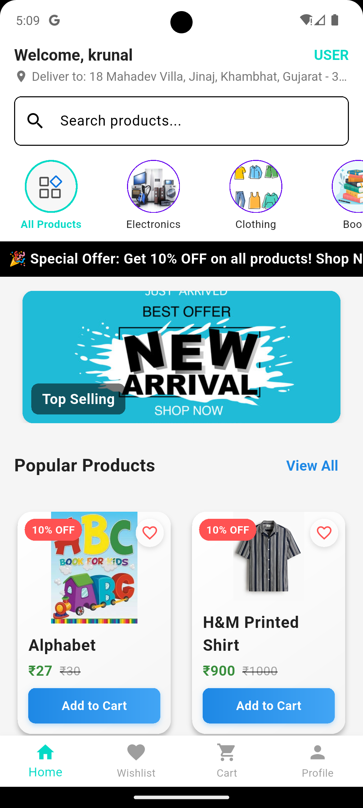 | 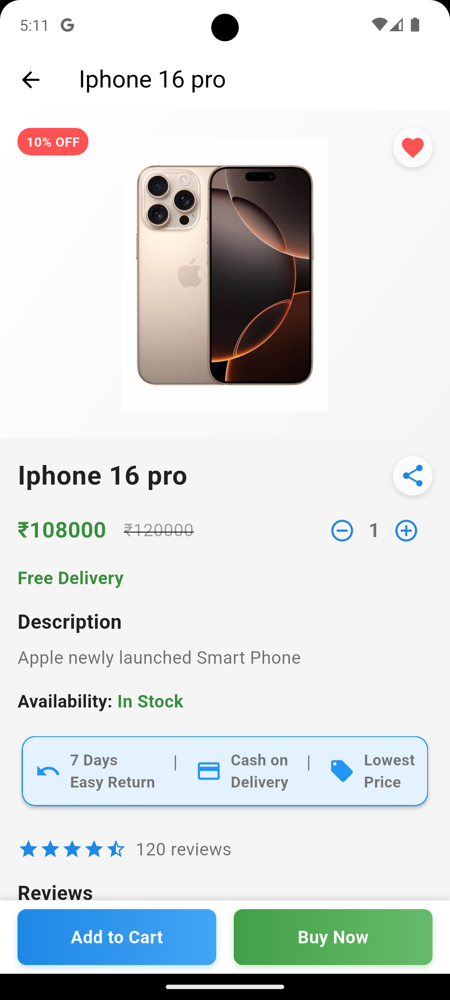 | 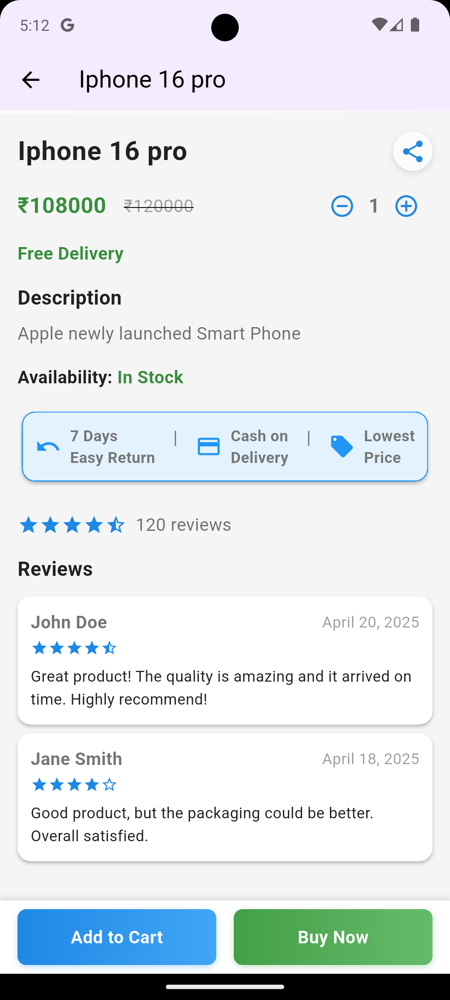 | 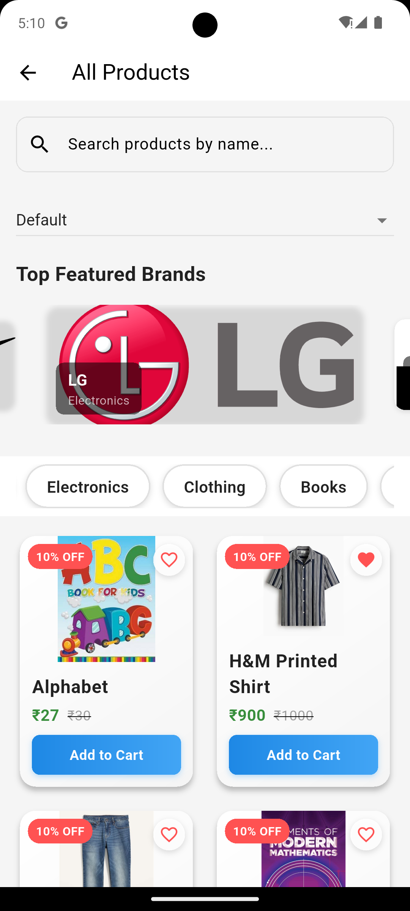 | 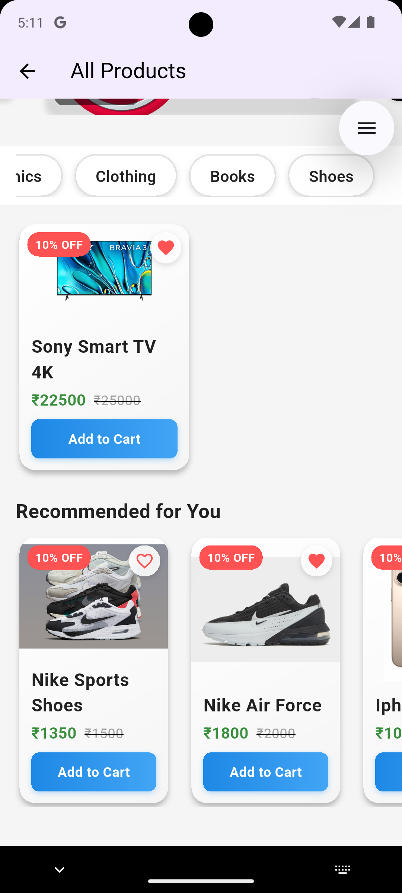 |

| Cart | Checkout | Success | My Orders | My Orders 2 |
|------|----------|---------|-----------|-------------|
| 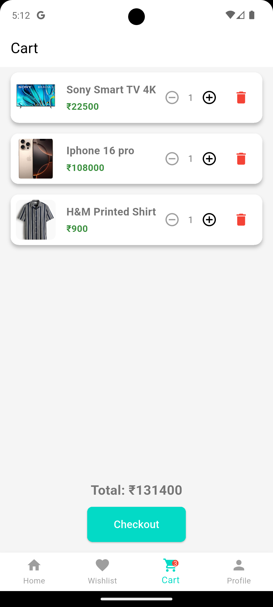 | 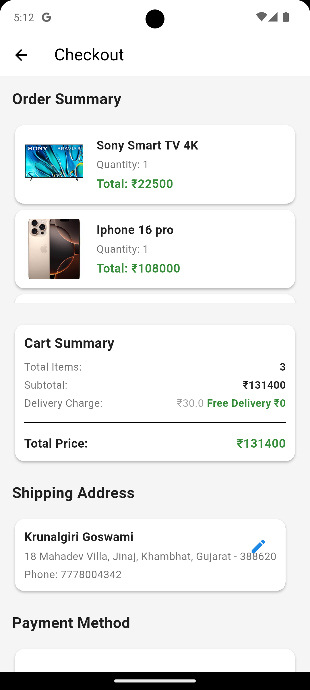 | 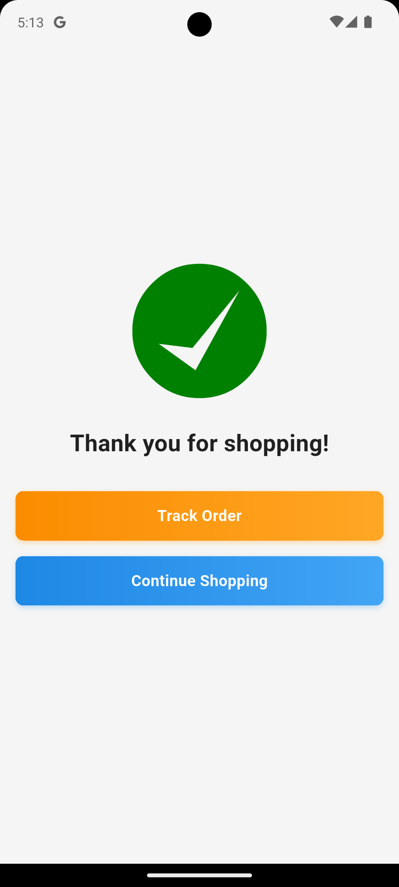 | 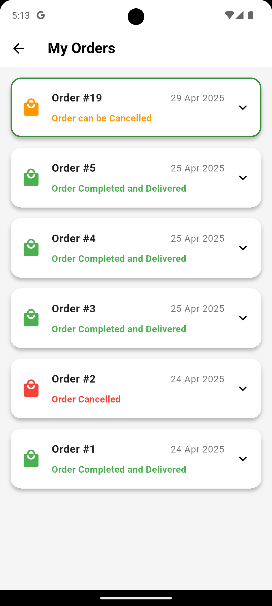 | 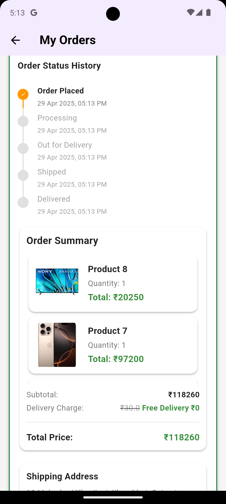 |

| Wishlist | Address | Add Address |
|----------|---------|-------------|
| 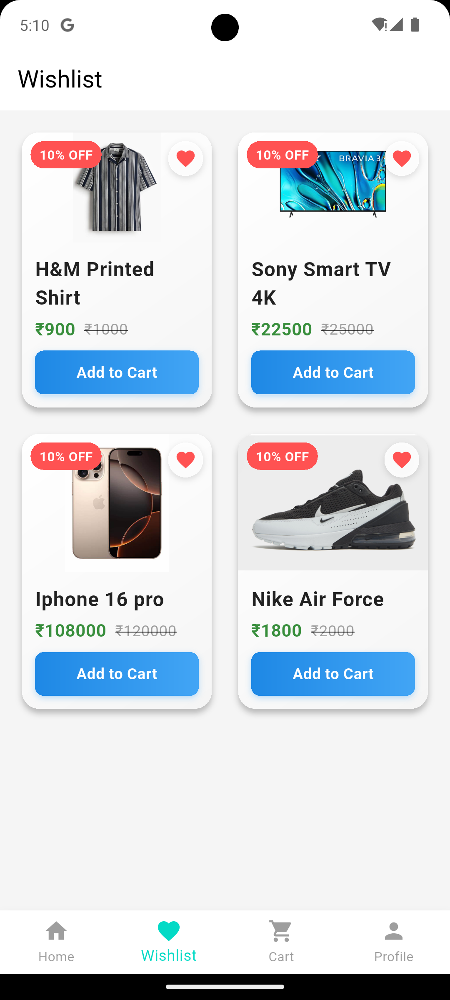 | 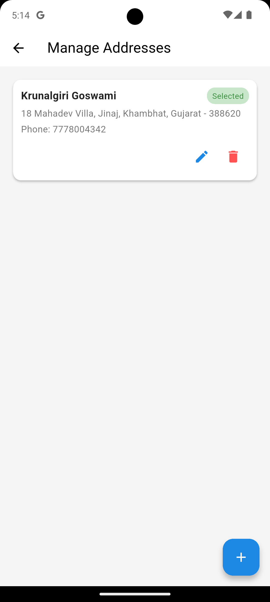 | 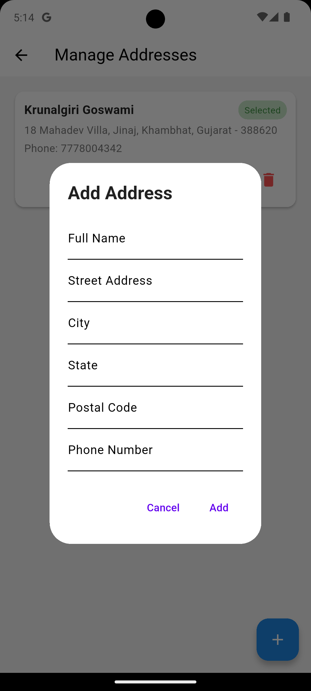 |

---

### 🧑‍💼 Admin Side

| Admin Home | Admin Products | Admin Categories | Admin Orders |
|------------|----------------|------------------|--------------|
| 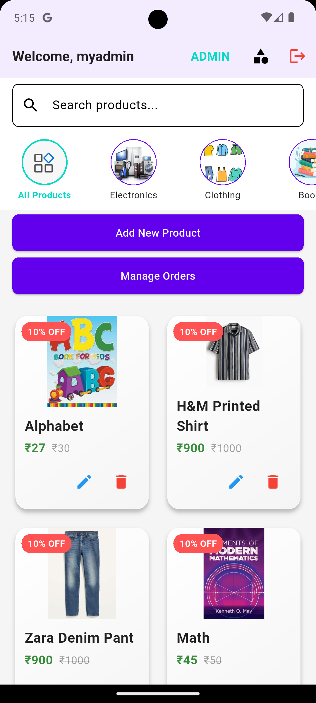 | 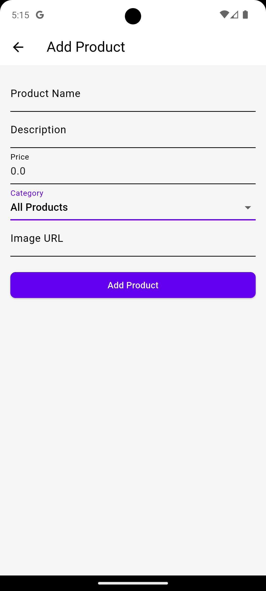 | 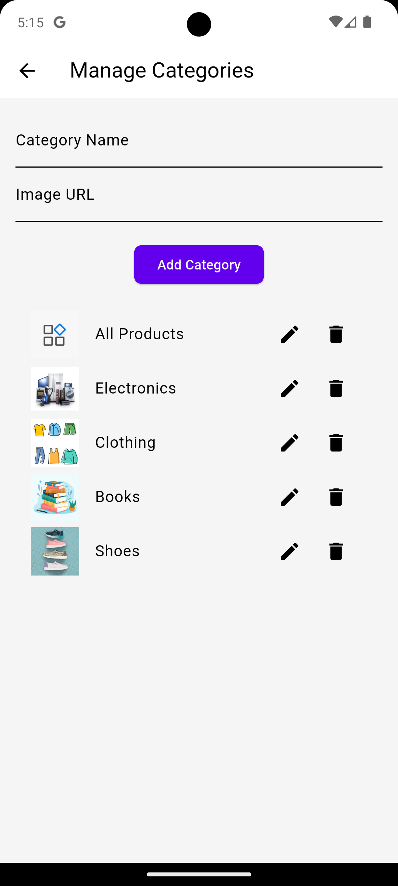 | 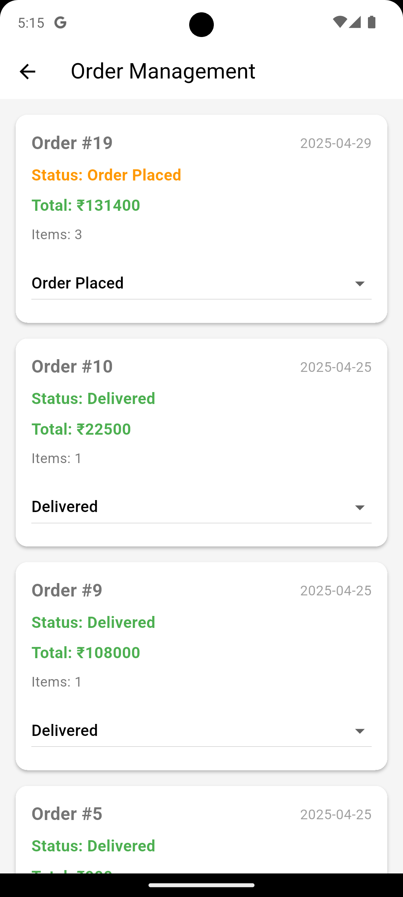 |

---

## 🚀 Features

### 👤 User Features
- 📱 Browse products by dynamic categories
- 🔍 View product details
- 🛒 Add to cart & checkout
- ✅ Order success flow
- 🧾 View my orders
- ❤️ Wishlist management
- 🏠 Address management with add/edit/delete
- 🔐 Secure login & role-based views

### 🧑‍💼 Admin Features
- ➕ Add new products and categories
- ✏️ Update and delete products
- 📦 View and manage orders
- 🎛️ Admin-only restricted access

---

## 🛠️ Tech Stack

- **Flutter** (Frontend)
- **Dart**
- **Provider** (State Management)
- **Spring Boot** (Backend – see backend repo)
- **MyBatis** + **MySQL**
- **JWT Authentication**
- **REST API Integration**

---

## 🔧 Setup Instructions

### 1. Clone the Repository

```bash
git clone https://github.com/KrunalgiriGoswami/Flutter-E-Commerce-App.git

cd Flutter-E-Commerce-App

2.Flutter-E-Commerce-App
flutter pub get

3.Run the app
flutter run

4.⚠️ Make sure your backend server is running and accessible.


